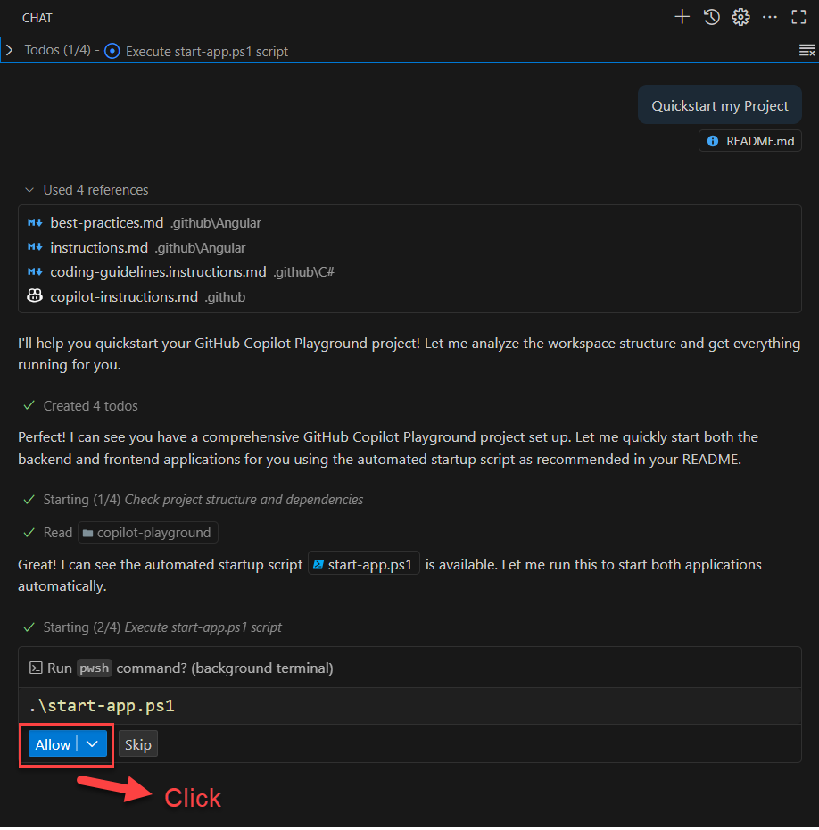

# 🚀 GitHub Copilot Playground

A comprehensive full-stack application designed as a **hands-on workshop** for learning and experimenting with **GitHub Copilot** across different development domains. This project demonstrates modern web development patterns while providing structured tasks to practice AI-assisted coding.

## 📋 Project Overview

This playground consists of a complete full-stack weather application with:

- **🔧 Backend**: ASP.NET Core Web API (.NET 8.0) with Swagger documentation
- **🌐 Frontend**: Angular 19+ with modern features (signals, standalone components)
- **🧪 Testing**: Playwright for E2E testing, NUnit for .NET backend testing, Karma/Jasmine for Frontend testing
- **💾 Database**: SQLite with Dapper ORM
- **⚙️ Infrastructure**: Azure DevOps pipelines with YAML templates

## 🎯 Learning Objectives

**Master GitHub Copilot across different development areas:**

- Backend API development with C# and .NET
- Modern Angular frontend development
- Database schema design and SQL queries
- E2E and unit testing with AI assistance
- Infrastructure as Code (YAML pipelines, Terraform)
- Code review and refactoring guidance

## 🚀 Quick Start with GitHub Copilot

### Prerequisites

- .NET 8.0 SDK
- Node.js (LTS version)
- Angular CLI (`npm install -g @angular/cli`)
- **GitHub Copilot enabled** in your IDE

### 🎯 **Use Copilot to Start the Project**

**Ask GitHub Copilot:** _"Quickstart my Project"_



Or simply run the automated startup script:

```powershell
# Start both applications with auto-open browsers
.\start-app.ps1
```

This will automatically:

- ✅ Start the .NET backend API with HTTPS
- ✅ Start the Angular frontend development server
- ✅ Open Swagger UI at: https://localhost:5257/swagger
- ✅ Open the Angular app at: http://localhost:4200/

### Manual Start (if needed)

```powershell
# Backend
cd backend
dotnet run --launch-profile https

# Frontend (in new terminal)
cd frontend\frontend
npm install
npm start
```

## � Commit Message Configuration

This project includes **GitHub Copilot-optimized commit message settings** to help generate consistent, high-quality commit messages:

- **📁 `.vscode/settings.json`** - VS Code settings for commit message formatting and validation (add to your personal workspace)
- **📋 `.vscode/commit-message-guidelines.md`** - Conventional commit format guidelines and examples

**Features:**

- ✅ 50/72 character limits with visual rulers
- ✅ Conventional commit format (`feat:`, `fix:`, `docs:`, etc.)
- ✅ GitHub Copilot integration for AI-assisted commit messages
- ✅ Git input validation and warnings

## �📚 Workshop Tasks & Learning Path

**🤖 Start here:** **[GitHub Copilot Basics Guide](./doc/GitHub-Copilot-Basics.md)** - Essential features, modes, and best practices

**💡 The Tasks for the Workshop are in the `/doc/Tasks/` directory:**

- 🔧 **[Backend Tasks](./doc/Tasks/Backend-Tasks.md)** - API development, testing, and refactoring with Copilot
- 🌐 **[Frontend Tasks](./doc/Tasks/Frontend-Tasks.md)** - Angular components, testing, and modern patterns
- 🧪 **[Testing Tasks](./doc/Tasks/Test-Task.md)** - E2E testing, API testing, and test automation
- 💾 **[Database Tasks](./doc/Tasks/Database-Tasks.md)** - Schema design, SQL queries, and optimization
- ⚙️ **[Infrastructure Tasks](./doc/Tasks/Infra-Tasks.md)** - YAML pipelines, Terraform, and DevOps automation
- 🏗️ **[Solution Architect Tasks](./doc/Tasks/Solution-Architect-Tasks.md)** - System design, diagrams, documentation, and architecture patterns
