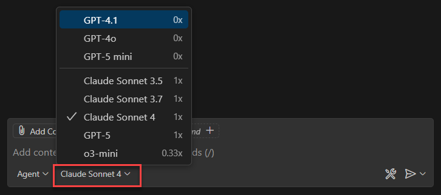
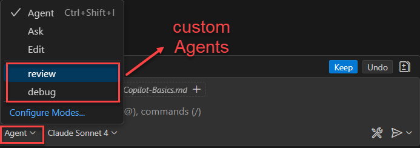
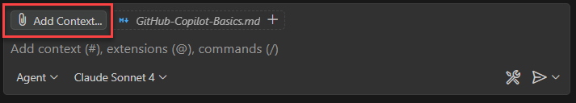
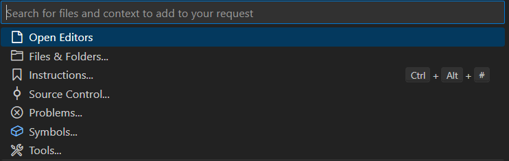
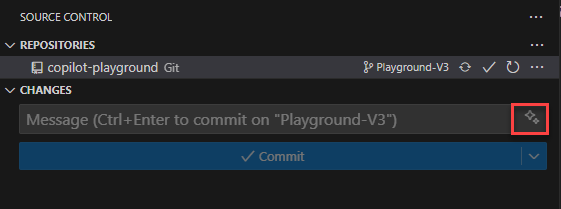

# 🤖 GitHub Copilot Basics Guide

Quick reference for GitHub Copilot features, modes, and best practices.

## 🧠 Models



These are the now available models. Models with **Request Rate 0X** have unlimited usage, while models with **Request Rate 1X** are limited to 300 requests per month.

## 🎮 Interaction Modes

1. **Ask Mode** 💬 - Q&A for explanations and guidance
2. **Edit Mode** ✏️ - Modify existing code with instructions
3. **Agent Mode** 🤖 - Complex tasks with `#codebase`, `@vscode`, `@terminal`, `@github`
   - **Note:** `@workspace` is deprecated and will fade out. Use `#codebase` (newer version) for the same functionality
4. **Inline Suggestions** ⚡ - Real-time code completion

## 💬 Chat Mode

**Shortcuts:** `Ctrl+Shift+I` (chat), `Ctrl+L` (inline), `Ctrl+I` (compose)

**Capabilities:**

- Code explanation and generation
- Debugging and troubleshooting
- Code review and security analysis
- Architecture guidance

## 📝 Copilot Instructions Files

Provide project-specific context to improve AI responses.

**Locations:**

- `.github/copilot-instructions.md` (repo-wide)
- `.copilot-instructions.md` (directory-specific)

**Structure:**

```markdown
# Project Guidelines

- Tech stack: .NET 8.0, Angular 19+, SQLite
- Patterns: Repository, DI, async/await
- Standards: Standalone components, signals
```

**Tips:** Be specific, include examples, mention tech stack

## 🎭 Chat Modes (.chatmode.md)

**What they are:** Configuration files that create specialized AI assistants with specific expertise, tools, and behaviors for different development tasks.

**Why use them:** Get consistent, focused assistance tailored to your workflow - whether you're debugging, reviewing code, or planning architecture. Each mode follows your project's standards and uses only relevant tools.

**Common modes:** Review (code quality), Debug (problem solving), Architecture (design decisions), Testing (quality assurance).



### Quick Setup

**Location:** `.github/chatmodes/mode-name.chatmode.md`

**Basic Format:**

````markdown
```chatmode
---
description: "Brief description"
tools: ['edit', 'search', 'problems', 'runCommands']
---

# Mode Name
You are a specialized AI for [task]. Follow project standards in `.github/`.
```
````

### Common Tools

- `'edit'`, `'search'`, `'new'` - Core editing
- `'problems'`, `'changes'`, `'usages'` - Analysis
- `'runCommands'`, `'testFailure'` - Execution

### Usage

- **Activate:** ` /mode-name`
- **Examples:** `/review`, `/debug`, `/architecture`

## 🎯 Context and Prompting

### Understanding Context




Copilot uses multiple sources of context:

#### **File Context** 📁

- Current file content
- Related files in the project
- Import statements and dependencies

#### **Project Context** 🏗️

- Project structure and architecture
- Configuration files (package.json, .csproj)
- Documentation and README files

#### **Conversation Context** 💭

- Previous chat messages
- Code that was recently discussed
- Follow-up questions and clarifications

## 📝 Custom Commit Messages

**Setup:** Enable GitHub Copilot to generate commit messages automatically based on your staged changes.

**How to activate:**

**VS Code:** Enable "Generate Commit Messages" in Copilot settings



**Location:** `.vscode/settings.json` (workspace-specific) or User Settings (global)
Example:

```json
{
  "github.copilot.enable": {
    "*": true,
    "plaintext": false,
    "markdown": true,
    "scminput": true
  },
  "git.enableSmartCommit": true,
  "git.suggestSmartCommit": true,
  "github.copilot.chat.commitMessageGeneration": true,
  "github.copilot.chat.commitMessageGenerationMode": "enhanced"
}
```

**Workspace vs Global Settings:**

- **`.vscode/settings.json`**: Project-specific settings (recommended for teams)
- **User Settings**: Global VS Code settings (personal preference)
- Workspace settings override user settings

**Customization Options:**

```json
{
  // Commit message style preferences
  "git.inputValidation": "warn",
  "git.inputValidationLength": 72,

  // Custom commit message templates in .gitmessage
  "git.template": ".gitmessage",

  // Copilot behavior customization
  "github.copilot.advanced": {
    "inlineSuggestCount": 3,
    "listCount": 10
  }
}
```

## VS Code Integration

**Shortcuts:**

- `Ctrl+Shift+I` - Chat panel
- `Ctrl+L` - Inline chat
- `Ctrl+I` - Compose
- `Ctrl+.` - Quick fixes

## 📚 Resources

- [GitHub Copilot Docs](https://docs.github.com/en/copilot)
- [VS Code Extension](https://marketplace.visualstudio.com/items?itemName=GitHub.copilot)
- [GitHub Copilot in VS Code](https://code.visualstudio.com/docs/copilot/overview)
- [GitHub Copilot in VS](https://learn.microsoft.com/de-de/visualstudio/ide/visual-studio-github-copilot-get-started?view=vs-2022)

---
